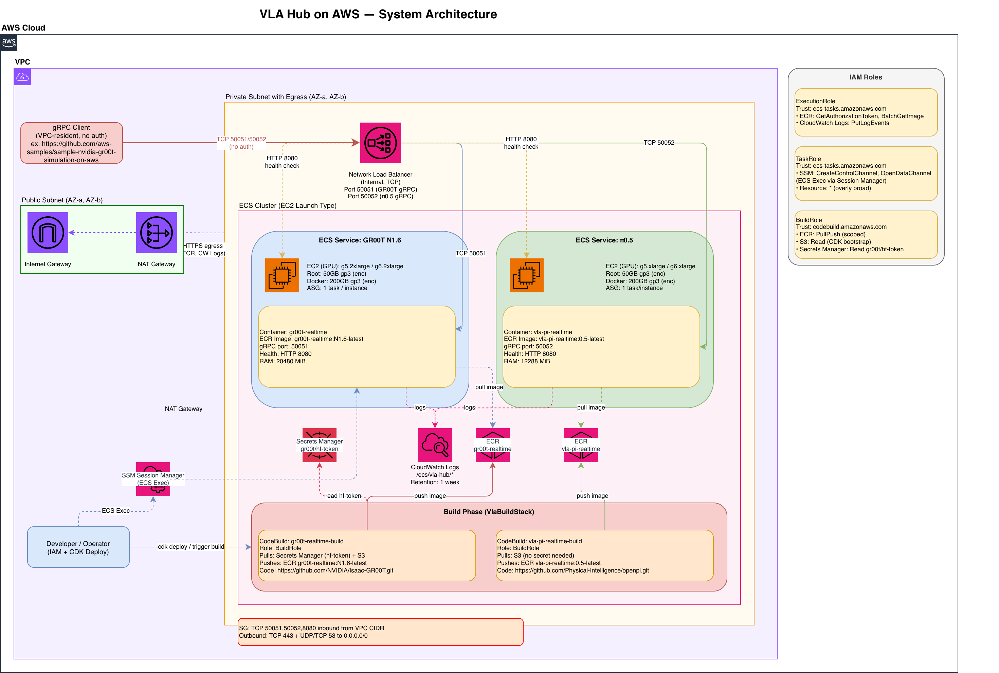

# vla-hub

VLA (Vision-Language-Action) model hub for realtime inference on AWS ECS (EC2 GPU).

Five OSS VLA policies — **GR00T N1.6**, **GR00T N1.7**, **π0.5**, **OpenVLA-7B**,
**SmolVLA-450M** — packaged as independent gRPC endpoints in a single CDK project.
Pick the model that fits your robot, deploy in minutes, swap models without
re-architecting clients. Each stack ships its own VPC, internal NLB, ECS cluster,
ASG, and ECR repo.

Adding a sixth model = one entry in `vla-hub.json` + a `docker/<model>/` context
+ matching stacks. The `AzSelectorConstruct` probes EC2 GPU capacity at deploy
time and pins the ASG to a confirmed AZ — no manual capacity hunting.

## Model Selection Policy

The hub does **not** restrict itself to fully-generalist VLAs. In practice every public
VLA sits somewhere on a generalist↔specialist spectrum, and the threshold is fuzzy.
The policy is therefore:

> **A model is a candidate as long as it is OSS, subject to two guardrails:**
> 1. **gRPC serving must be feasible.** The model must either ship gRPC serving
>    code, or be wrappable by a thin adapter under `docker/<model>/serve.py`.
>    Models that only ship custom training code are excluded.
> 2. **Stack compatibility.** The model must run on a standard PyTorch or JAX
>    container. Specialized CUDA kernels or non-standard runtimes are excluded
>    on operational-cost grounds.
>
> Models passing both guardrails are included even if they lean toward the
> specialist end. The capability matrix below lets operators and clients
> pick a fit on a case-by-case basis.

## Capability Matrix

| Model | License | Pretrain Scope | Embodiments (zero-shot) | Environments | New Embodiment Cost | Inference Hz | Stack | Best Fit |
|-------|---------|---------------|------------------------|--------------|--------------------|-------------|------|----------|
| **GR00T N1.6** | NVIDIA | OXE + NVIDIA fleet | gr1, behavior_r1_pro, robocasa_panda_omron | Sim+Real | MLP only (~$10, hours) | ~10 Hz (System2) / 120 Hz (System1) | PyTorch | New-robot PoC, MLP fine-tune demo |
| **GR00T N1.7** | NVIDIA | N1.6 + additional robot data | (N1.6 superset) | Sim+Real | MLP only (~$10, hours) | ~10 / 120 Hz | PyTorch | Same as N1.6 + precision assembly, loco-manipulation |
| **π0.5** | Apache-2.0 | Mobile robots + static arms + web data (~400h+) | Robots within co-training distribution | Sim+Real | Action Expert + LoRA(VLM) ($100s, days) | ~6 Hz | JAX | Mobile manipulation; in-distribution robots |
| **OpenVLA-7B** | MIT | OXE 970K (Bridge / Franka centric) | Bridge, Franka centric | Sim+Real (limited) | Effectively retrain ($1000s) | ~6 Hz on RTX 4090 | PyTorch | Broadest community baseline; LoRA fine-tune |
| **SmolVLA-450M** | Apache-2.0 | LeRobot community data | Lightweight robots | Sim+Real (limited) | Full-FT lightweight | Relatively fast | PyTorch | Edge / small robots; fast iteration |

> **Note**: Zero-shot feasibility depends on how close the customer robot is to
> the model's pretraining distribution. The table reflects embodiments that are
> explicitly part of pretraining; out-of-distribution embodiments require
> fine-tuning regardless of model.

### Scenario fit

| Scenario | Recommended (1st) | Alternatives |
|----------|-------------------|--------------|
| New customer robot, fast PoC | GR00T N1.7 (MLP fine-tune) | GR00T N1.6 |
| Precision assembly / loco-manipulation demo | GR00T N1.7 | GR00T N1.6 |
| Mobile manipulation (navigation + manipulation) | π0.5 | — |
| Cross-embodiment comparison demo | GR00T MLP vs π0.5 co-train vs OpenVLA full-FT in parallel | LAP-3B (experimental) |
| Edge / small robot | SmolVLA-450M | OpenVLA quantized |
| Most conservative baseline (community ground truth) | OpenVLA-7B | — |

### Where each model sits on the spectrum

```
Generalist  ─────────────────────────────────────  Specialist
       LAP-3B   π0.5    GR00T   SmolVLA   OpenVLA   Fast-WAM
       (exp.)  (co-train) (MLP)             (Bridge/  (LIBERO/
                                            Franka)   RoboTwin sim)
                                                      ❌ outside hub
```

Single-sim / single-embodiment specialists such as Fast-WAM are better operated
ad-hoc outside the hub: they only run inside one sim, so they do not generalize
across customer scenarios.

## Architecture



```
Robot / Sim Client
  │
  ├─ gRPC (TCP:50050) → GR00T N1.6 NLB  → ECS Task (g6/g5 GPU) — GR00TInference
  ├─ gRPC (TCP:50051) → GR00T N1.7 NLB  → ECS Task (g6/g5 GPU) — GR00TInference
  ├─ gRPC (TCP:50052) → π0.5 NLB        → ECS Task (g5/g6 GPU) — PIInference
  ├─ gRPC (TCP:50053) → OpenVLA NLB     → ECS Task (g6/g5 GPU) — OpenVLAInference
  └─ gRPC (TCP:50054) → SmolVLA NLB     → ECS Task (g6/g5 GPU) — SmolVLAInference
```

Each stack is isolated:
- Independent VPC, NLB, ECS Cluster, ASG, ECR repo
- Internal NLB (not internet-facing) — gRPC clients must reside in the same VPC
- gRPC inference port: model-specific (50050–50054), one port per model
- Port 8080: HTTP health server (NLB health check target)

## Stacks

Each `model id × version` combination from `vla-hub.json` produces an independent
build stack and ECS stack. Adding a new model = entry in `vla-hub.json` +
`docker/<model>/` context + matching stacks emitted by the CDK app.

Current model entries (see `vla-hub.json`):

| Model | Version | Port | Build Stack | ECS Stack |
|-------|---------|------|-------------|-----------|
| GR00T | N1.6 | 50050 | `Gr00tN16BuildStack` | `Gr00tN16EcsStack` |
| GR00T | N1.7 | 50051 | `Gr00tN17BuildStack` | `Gr00tN17EcsStack` |
| π     | 0.5  | 50052 | `PiBuildStack` | `PiEcsStack` |
| OpenVLA | 7b | 50053 | `OpenvlaBuildStack` | `OpenvlaEcsStack` |
| SmolVLA | 450M | 50054 | `Smolvla450mBuildStack` | `Smolvla450mEcsStack` |

## Quick Start

### Prerequisites

```bash
npm install
npm run build
cdk bootstrap
```

### Phase 1: Build container images

Each model has its own build stack. Deploy the build stacks for the models you
want, then trigger their CodeBuild projects:

```bash
# GR00T N1.6 / N1.7: require HuggingFace token in Secrets Manager
# (default secret name: gr00t/hf-token; override with -c hfTokenSecretName=<name>)
cdk deploy Gr00tN16BuildStack
cdk deploy Gr00tN17BuildStack

# π0.5: no token needed (public GCS checkpoint)
cdk deploy PiBuildStack

# OpenVLA-7B: HuggingFace public model — token only needed for rate-limit
cdk deploy OpenvlaBuildStack

# SmolVLA-450M: HuggingFace public model
cdk deploy Smolvla450mBuildStack
```

After CodeBuild completes, note the ECR image URIs from each stack's outputs.

### Phase 2: Deploy inference stacks

```bash
# GR00T N1.6
cdk deploy Gr00tN16EcsStack \
  -c gr00tN16EcrImageUri=<account>.dkr.ecr.<region>.amazonaws.com/gr00t-n16-realtime:latest

# GR00T N1.7
cdk deploy Gr00tN17EcsStack \
  -c gr00tN17EcrImageUri=<account>.dkr.ecr.<region>.amazonaws.com/gr00t-n17-realtime:latest

# π0.5
cdk deploy PiEcsStack \
  -c piEcrImageUri=<account>.dkr.ecr.<region>.amazonaws.com/vla-pi-realtime:latest

# OpenVLA-7B
cdk deploy OpenvlaEcsStack \
  -c openvlaEcrImageUri=<account>.dkr.ecr.<region>.amazonaws.com/openvla-realtime:latest

# SmolVLA-450M
cdk deploy Smolvla450mEcsStack \
  -c smolvla450mEcrImageUri=<account>.dkr.ecr.<region>.amazonaws.com/smolvla-450m-realtime:latest
```

### Optional CDK context overrides

```bash
-c instanceTypes=g6.2xlarge,g5.2xlarge   # comma-separated fallback list
-c desiredCount=1
```

### Stack outputs

| Output | Description |
|--------|-------------|
| `GrpcEndpoint` | NLB DNS + model-specific port — gRPC inference endpoint |
| `VpcId` | Place gRPC client EC2 in this VPC |
| `PrivateSubnetIds` | Place gRPC client EC2 in one of these subnets |
| `ClusterName` / `ServiceName` | ECS identifiers |
| `SelectedInstanceType` / `SelectedAZ` | AzSelector probe result |

## gRPC Interfaces

Each model ships its own `.proto`. All five expose `Infer` + `Health` RPCs with
the per-model schema appropriate to that model's input/output conventions.

| Model | Proto | Service | Port |
|-------|-------|---------|------|
| GR00T N1.6 | `docker/gr00t-n16/gr00t.proto` | `GR00TInference` | 50050 |
| GR00T N1.7 | `docker/gr00t-n17/gr00t.proto` | `GR00TInference` | 50051 |
| π0.5 | `docker/pi/pi.proto` | `PIInference` | 50052 |
| OpenVLA-7B | `docker/openvla/openvla.proto` | `OpenVLAInference` | 50053 |
| SmolVLA-450M | `docker/smolvla/smolvla.proto` | `SmolVLAInference` | 50054 |

Common shape for `Infer`:

- Input: `image_data` (JPEG bytes), `instruction` (string), optional joint states
- Output: `action_chunks` — `map<string, bytes>` (float32 `tobytes`, reshape to
  `(H, DOF)` per the model's action-chunk convention)

`Health(HealthRequest) → HealthResponse` is provided on every service for NLB /
client probes.

## Instance Type Selection

`AzSelectorConstruct` probes EC2 capacity at deploy time and pins the ASG to a
confirmed AZ.

| Model | Priority order |
|-------|---------------|
| GR00T N1.6 / N1.7 | g6.2xlarge → g5.2xlarge → g6.xlarge → g5.xlarge |
| π0.5 | g5.2xlarge → g5.xlarge → g6.2xlarge → g6.xlarge |
| OpenVLA-7B | g6.2xlarge → g5.2xlarge → g6.xlarge → g5.xlarge |
| SmolVLA-450M | g6.xlarge → g5.xlarge → g6.2xlarge → g5.2xlarge |

GR00T (and OpenVLA's FlashAttention path) require Ampere GPU (SM80+). π0.5 uses
JAX and does not require FlashAttention.

## Docker Contexts

```
docker/
├── gr00t-n16/   # GR00T N1.6 container (PyTorch + Isaac Lab gRPC server)
├── gr00t-n17/   # GR00T N1.7 container (PyTorch + Isaac Lab gRPC server)
├── pi/          # π0.5 container (JAX + pi0.5 gRPC server)
├── openvla/     # OpenVLA-7B container (PyTorch + HuggingFace gRPC server)
└── smolvla/     # SmolVLA-450M container (PyTorch + LeRobot gRPC server)
```

Each context is packaged as an S3 Asset and passed to CodeBuild. When
`docker/<model>/` changes, redeploy the corresponding BuildStack.

---

## Design FAQ

### Why ECS + NLB instead of Amazon SageMaker?

SageMaker supports Triton Inference Server internally, but it only exposes an
**HTTP REST endpoint** externally. The Triton gRPC port (`:8001`) is inaccessible
from outside the SageMaker container. This makes SageMaker unsuitable for two
requirements:

1. **Direct gRPC connection from robots** — robots and simulators connect over
   gRPC directly; SageMaker cannot expose a raw gRPC port.
2. **mTLS end-to-end** — SageMaker terminates TLS at its own layer, so E2E mTLS
   between robot and inference container is not achievable.

ECS + NLB (L4 passthrough) hands TLS termination to the ECS Task itself,
enabling full gRPC + mTLS control.

> For simple PoC/demo with REST, SageMaker is fine. For production-style robot
> connectivity patterns, ECS + NLB is correct.

### Why serve.py directly instead of Triton Inference Server?

| Factor | serve.py (current) | Triton Python backend |
|--------|-------------------|-----------------------|
| Custom `.proto` | ✅ Per-model proto preserved | ❌ Must migrate to Triton standard proto → client SDK rewrite |
| GR00T monkey-patch | ✅ In serve.py init | Possible in `model.py` init, same complexity |
| π0.5 JAX runtime | ✅ Isolated ECS Task | JAX + PyTorch on the same GPU is risky (memory pre-allocation conflict) |
| Prometheus metrics | Manual | ✅ Built-in |
| Dynamic batching | Manual (ASG scale-out) | ✅ Built-in |

**Current verdict**: Triton adds operational complexity without reducing code
complexity. The blocking issue is the custom `.proto` requirement — migrating
to Triton's standard `generate.proto` would require rewriting all client SDKs
and the ZMQ-gRPC bridge. Additionally, π0.5 (JAX) and GR00T (PyTorch) cannot
safely share a GPU due to JAX's pre-emptive memory allocation
(`XLA_PYTHON_CLIENT_MEM_FRACTION`).

Re-evaluate when NVIDIA ships an official TensorRT-optimized GR00T package —
that would eliminate the monkey-patch requirement and make adopting the
standard Triton proto natural. See
[Triton Inference Server](https://github.com/triton-inference-server/server)
for upstream reference.

### Why gRPC instead of WebSocket?

Key reasons for Physical AI inference workloads:

- **Protobuf compression** — 200 KB JSON observation → ~20 KB (~10× reduction)
- **gRPC metadata** — robot ID, model ID carried at schema level (no app-layer workarounds)
- **HTTP/2 multiplexing** — multiple concurrent robot streams over a single connection
- **Strong typed interface** — `.proto` auto-generates both server and client code

NLB sticky routing (TCP 5-tuple hash) works identically for both gRPC and
WebSocket — it is not a differentiator. The advantages above are
protocol-level, not routing-level.

### Why NLB instead of ALB?

NLB operates at L4 (TCP passthrough) — TLS is terminated inside the ECS Task
container, enabling E2E mTLS. ALB terminates TLS at the load balancer layer,
breaking the mTLS chain. NLB also handles long-lived gRPC streaming
connections without HTTP-layer timeouts.

---

## Production Considerations

This repository is a sample for demonstration and PoC use. Before adapting it
for production or customer-facing workloads, review the following — none are
hard blockers, but each is a deliberate scoping choice in the sample:

- **Exposure**: gRPC endpoints are bound to an **internal NLB** (not
  internet-facing). Clients must reside in the same VPC. For external clients,
  add VPC peering, Transit Gateway, or PrivateLink — do not flip the NLB to
  internet-facing without an auth layer in front.
- **Auth**: There is **no auth layer in front of gRPC**. mTLS is supported at
  the protocol level (NLB is L4 passthrough, TLS terminates in the task), but
  certificate provisioning and client identity are out of scope here. Add
  before exposing beyond the trusted VPC.
- **Availability**: Each ECS service runs **single-AZ** by design (the
  `AzSelectorConstruct` pins the ASG to one confirmed-capacity AZ). For HA,
  switch to multi-AZ ASG with capacity rebalancing, or run two stacks in
  different AZs behind a regional endpoint.
- **Data**: The sample processes **no customer data**. Model weights are
  downloaded from HuggingFace **at container runtime** (not baked into images)
  using a short-lived HuggingFace token stored in AWS Secrets Manager. For
  air-gapped or offline deployments, mirror weights to an internal ECR or S3
  artifact store and bake them into the image.
- **Support**: Provided as-is. No SLA, no backward compatibility guarantee
  across model versions or CDK revisions. Pin a tag and treat upgrades as
  PoC-grade migrations.

Operators are expected to evaluate the architecture against their own security,
compliance, and availability requirements before any customer-facing use.
